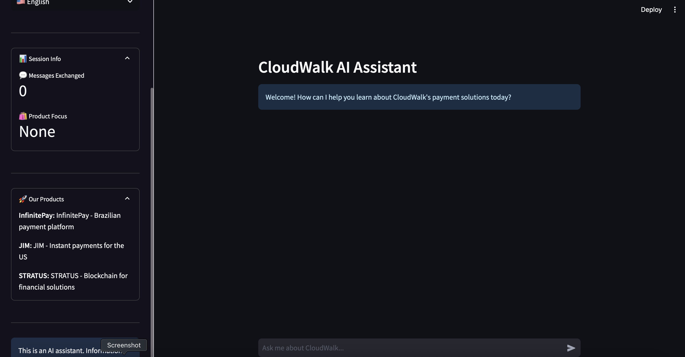
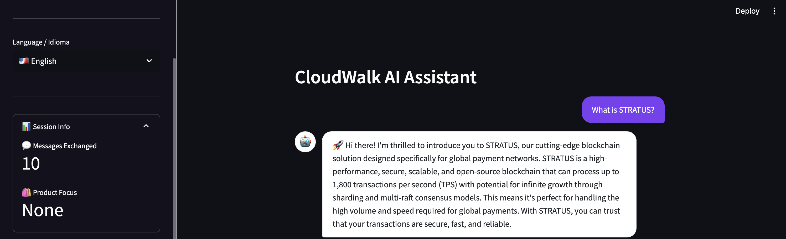
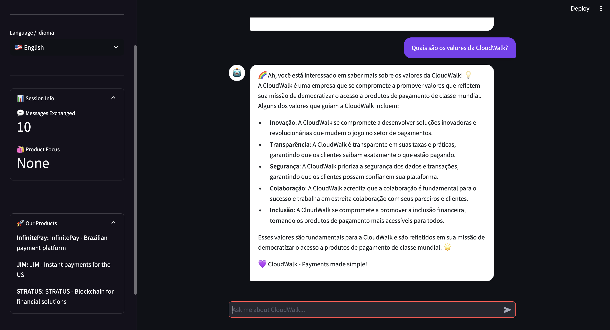
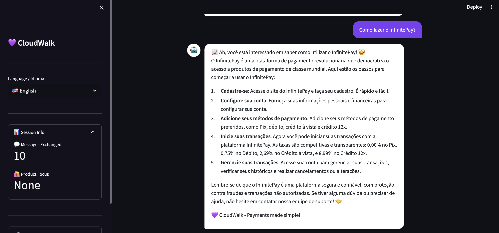

# ☁️ CloudWalk AI Assistant

This is an AI-powered chatbot designed to answer questions about CloudWalk's innovative payment solutions, including InfinitePay, JIM, and STRATUS. It leverages a Retrieval-Augmented Generation (RAG) architecture to provide accurate answers based on a dedicated knowledge base.



## ✨ Features

- **Multi-Lingual Support**: Interacts seamlessly in English and Portuguese.
- **Intelligent Responses**: Uses modern open-source AI models (via Groq) to understand and answer user questions.
- **RAG Architecture**: Pulls information from a vector knowledge base to provide accurate, context-aware answers about products, pricing, and features.
- **Modern UI**: Built with Streamlit to provide a clean, responsive, and user-friendly chat interface.
- **Context-Aware**: Detects user intent and language to tailor the conversation.

## 🤖 Demonstration

Here are a few examples of the CloudWalk AI Assistant in action, showcasing its ability to answer questions about different products and in multiple languages.

| Answering about STRATUS (English)                               | Answering about CloudWalk's Values (Portuguese)      |
| :-------------------------------------------------------------- | :--------------------------------------------------- |
|                          |  |
| **Answering "How to use InfinitePay?" in Portuguese**           |                                                      |
|  |                                                      |

## 🛠️ Tech Stack

- **Frontend**: Streamlit
- **Backend/Orchestration**: LangChain
- **AI Model**: Groq API (Llama 3 / Gemma)
- **Vector Database**: ChromaDB
- **Embeddings**: Sentence-Transformers `all-MiniLM-L6-v2`

## 🚀 Getting Started

Follow these steps to set up and run the project locally.

### Prerequisites

- Python 3.10+
- A free [Groq API Key](https://console.groq.com/keys)

### 1. Clone the Repository

```bash
git clone [https://github.com/louiseluli/cloudwalk-ai-assistant.git](https://github.com/louiseluli/cloudwalk-ai-assistant.git)
cd cloudwalk-ai-assistant
```

### 2. Set Up a Virtual Environment

It's highly recommended to use a virtual environment.

```bash
# For Mac/Linux
python3 -m venv venv
source venv/bin/activate

# For Windows
python -m venv venv
.\venv\Scripts\activate
```

### 3. Install Dependencies

Install all the required packages using a `requirements-mac-friendly.txt` file.

```bash
pip install -r requirements-mac-friendly.txt
```

### 4. Configure Environment Variables

Create a file named `.env` in the root of the project directory. Add your Groq API key to this file:

```
GROQ_API_KEY="your_groq_api_key_here"
```

### 5. Run the Application

Launch the Streamlit application from your terminal.

```bash
python -m streamlit run src/streamlit_app.py
```

The app should now be open and running in your web browser!
